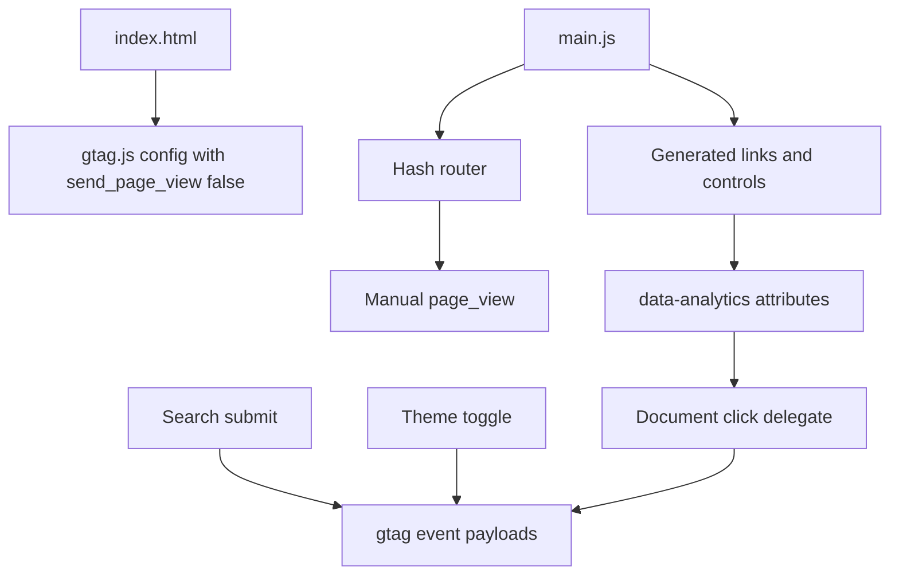

# Design: add-google-analytics

## Overview

Use the existing head-level GA tag for loading `gtag.js`, but disable its automatic page view. Add a lightweight analytics layer in `main.js` that sends manual SPA page views after route rendering and delegates click tracking from generated `data-analytics-*` attributes.

## Architecture



## Event Taxonomy

| Event | Trigger | Key Parameters |
|-------|---------|----------------|
| `page_view` | Route render when hash path changes | `page_title`, `page_location`, `page_path`, `route_name`, `content_type`, `content_id` |
| `nav_click` | Top navigation link | `ui_region`, `link_url`, `link_text`, `link_action` |
| `brand_click` | Site title link | `content_type=home`, `content_id=home` |
| `read_more_click` | Home about preview link | `content_type=page`, `content_id=about` |
| `topic_click` | Topic/tag chips | `content_type=tag`, `content_id=<tag slug>` |
| `featured_post_click` | Hero shell click | `content_type=post`, `content_id=<post slug>` |
| `featured_post_media_click` | Hero media link | `content_type=post`, `content_id=<post slug>` |
| `featured_post_title_click` | Hero title link | `content_type=post`, `content_id=<post slug>` |
| `post_card_click` | Post cards | `content_type=post`, `content_id=<post slug>` |
| `project_card_click` | Project cards | `content_type=project`, `content_id=<project slug>` |
| `back_link_click` | Detail page back links | `ui_region=post_detail/project_detail` |
| `ai_resource_click` | AI panel resource links | `ui_region=ai_panel` |
| `skill_resource_click` | Skill repo/docs links | `content_type=skill`, `content_id=<skill slug>` |
| `contact_link_click` | Contact links | `ui_region=home_connect/about_connect` |
| `resource_link_click` | Generic same-domain non-hash links | `link_url`, `link_text` |
| `click` | Outbound links | `outbound=true`, `link_domain` |
| `search` | Search form submit | `search_term`, `ui_region=topbar` |
| `theme_change` | Theme toggle | `theme`, `ui_region=topbar` |

## Implementation Details

### `index.html`

- Keep the existing Google tag loader.
- Change the config call to:

```javascript
gtag("config", "G-EHDL9M60FS", { send_page_view: false });
```

### `main.js`

- Add `GA_MEASUREMENT_ID`.
- Add helper functions:
  - `isAnalyticsReady`
  - `getRoutePath`
  - `getRouteAnalytics`
  - `trackAnalyticsEvent`
  - `trackPageView`
  - `getLinkAnalytics`
  - `initializeAnalyticsTracking`
- Call `trackPageView(route)` after each route's DOM is rendered.
- Add `data-analytics-*` attributes in render functions for stable reporting.
- Track search and theme interactions directly from their existing listeners.

## Error Handling

| Scenario | Handling |
|----------|----------|
| `gtag` blocked or unavailable | Tracking functions return without affecting UI |
| Re-render of same route | `lastTrackedPagePath` prevents duplicate page views |
| Link lacks explicit metadata | Delegate falls back to text, URL, domain, and internal/resource/outbound classification |

## Test Strategy

- Run `node --check main.js`.
- Static search for `send_page_view`, analytics helper functions, and `data-analytics-*` attributes.
- Browser verification on a local server:
  - Initial home `page_view`.
  - Nav click to `#/posts` and listing `page_view`.
  - Search submit event and query route `page_view`.
  - Theme toggle event.
  - Post card click and post detail `page_view`.
