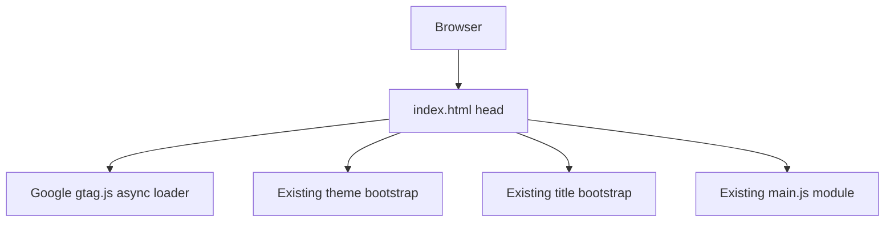

# Design: add-google-analytics

## Overview

Add the official Google Analytics `gtag.js` snippet directly to the `index.html` head. The snippet remains independent from existing inline bootstrap scripts and the `main.js` module.

## Architecture

### Component Diagram



### Components

#### Google Analytics Tag
**Purpose**: Load Google Analytics and configure measurement ID `G-EHDL9M60FS`.
**Responsibilities**:
- Initialize `window.dataLayer`.
- Define `gtag`.
- Send `js` and `config` initialization calls.

#### Existing Page Bootstrap
**Purpose**: Preserve current site initialization.
**Responsibilities**:
- Set initial theme.
- Load dynamic title.
- Load styles and `main.js`.

### Data Flow

1. Browser parses `index.html`.
2. Async Google tag loader starts loading without blocking page parsing.
3. Inline `gtag` setup initializes the data layer and configures the measurement ID.
4. Existing site scripts continue to run as before.

## Technical Decisions

| Decision | Options Considered | Choice | Rationale |
|----------|-------------------|--------|-----------|
| Placement | Head, body end, app module | Head | Matches Google snippet expectations and avoids coupling analytics to app logic |
| Implementation | Exact inline snippet, helper file | Exact inline snippet | Smallest change and matches user-provided code |
| Dependencies | Add package, no package | No package | Static site only needs the hosted script |

## File Structure

| File | Action | Purpose |
|------|--------|---------|
| `index.html` | Modify | Add Google Analytics loader and config |

## Interfaces

```javascript
window.dataLayer = window.dataLayer || [];
function gtag(){dataLayer.push(arguments);}
gtag("config", "G-EHDL9M60FS");
```

## Error Handling

| Error Scenario | Handling Strategy | User Impact |
|----------------|-------------------|-------------|
| Google script fails to load | Browser ignores failed async script | Site continues to work |

## Edge Cases

- **Analytics blocked**: Existing page behavior is unaffected because no app code depends on `gtag`.
- **Repeated page load**: Standard snippet initializes per page load.

## Dependencies

| Package | Version | Purpose |
|---------|---------|---------|
| None | N/A | No package dependency required |

## Security Considerations

- The only new external script source is the user-provided Google Tag Manager URL.

## Performance Considerations

- The loader uses `async` to avoid blocking parsing.

## Test Strategy

### Static Verification
- Confirm `index.html` contains the Google loader URL and config measurement ID.
- Confirm existing `main.js` module and head scripts remain present.

## Existing Patterns to Follow

Based on codebase analysis:
- Keep simple page bootstrap logic in `index.html`.
- Avoid changing app-level JavaScript for document-level tags.
